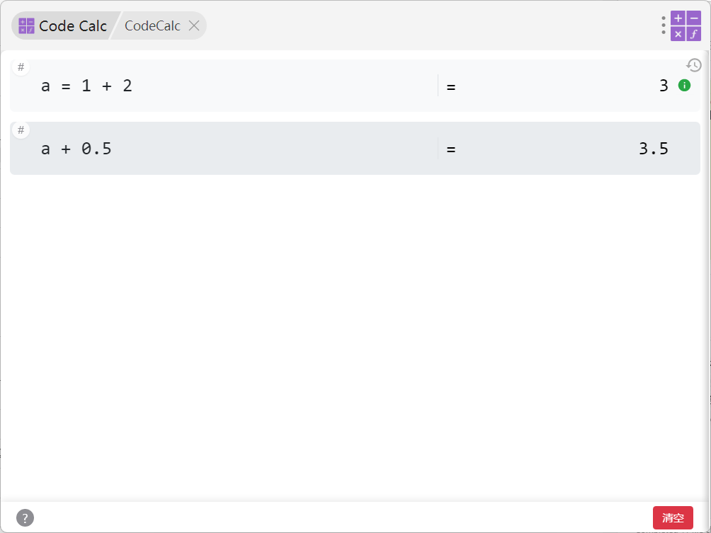

# 使用文档

{ width="50%"}

## 界面操作


- 每个表达式左上角的 `#图标` 可用于添加备注说明

- 界面左下角的 `问号图标`：

    - 鼠标悬停：显示基本操作提示
    - 点击：进入设置界面
        1. 可配置`语法补全`：开启/关闭输入提示功能
        2. 可配置`保留历史`：是否在退出插件时保留页面内容

## 历史记录功能

点击界面右上角的 `历史记录图标`，提供两个功能：

- `快照`功能：
    1. 可将当前页面的所有输入内容保存为快照
    2. 随时可以从快照恢复之前的页面状态

- `历史记录`功能：
    1. 清空页面时会自动保存当前内容
    2. 仅保留最近的历史记录，过期记录会自动清理
    3. 可随时将历史记录恢复到当前页面

![[image20250118233734.png]]{ width="50%"}
## 清空功能

- 点击`清空`按钮可清空整个页面
- 清空前会自动将当前内容保存到历史记录中


## 快捷键

|  功能   |       快捷键       |
| :---: | :-------------: |
| 下方插入行 | `Shift + Enter` |
| 删除当前行 |    `Delete`     |
| 历史快照  |   `Ctrl + H`    |
| 进入设置  |   `Ctrl + ~`    |
| 清空页面  |   `Ctrl + Q`    |

## 基本运算

|    运算符     | 说明  | 运算符  | 说明  |
| :--------: | :-: | :--: | :-: |
|    `+`     | 加法  | `//` | 整除  |
|    `-`     | 减法  | `%`  | 取余  |
| `*` or `x` | 乘法  | `**` | 幂运算 |
|    `/`     | 除法  | `=`  | 赋值  |
|    `+=`    | 加等于 | `&`  | 位与  |
|    `-=`    | 减等于 | `^`  | 异或  |
|    `*=`    | 乘等于 | `~`  | 取反  |
|    `<<`    | 左移  | `>>` | 右移  |

[[operator|更多运算符内容]]

## 函数

- `π`, `PI`, `pi` : 圆周率 (Math.PI)
- `e`, `E` : 自然对数的底 (Math.E)

|     函数      |       说明       |      函数       |       说明       |
| :---------: | :------------: | :-----------: | :------------: |
|    `ln`     |      自然对数      |     `lg`      |      常用对数      |
|    `log`    |       对数       |     `exp`     |       指数       |
|    `pow`    |      幂函数       |    `sqrt`     |      平方根       |
|    `abs`    |      绝对值       |     `max`     |      最大值       |
|    `min`    |      最小值       |     `sin`     |      正弦函数      |
|    `cos`    |      余弦函数      |     `tan`     |      正切函数      |
|   `atan`    |     反三角函数      |    `sinh`     |      双曲函数      |
|   `bin()`   |      转二进制      |    `oct()`    |      转八进制      |
|   `hex()`   |     转十六进制      |   `str(x)`    |  将输入的值转换为字符串   |
|  `num(x)`   |   将输入的值转换为数字   |  `upper(x)`   |   将字符串转换为大写    |
| `lower(x)`  |   将字符串转换为小写    |  `length(x)`  |    获取字符串的长度    |
| `base64(x)` | 对字符串进行Base64编码 | `unbase64(x)` | 对字符串进行Base64解码 |


[[function|更多函数内容]]

[[radix_arithmetic|更多进制转换内容]]

[[string |更多字符串内容]]


## 时间计算

时间表达式：

`#(..)y(..)m(..)w(..)d(..)h(..)mm(..)s(..)ms`


``` js

// 1年2个月3周4天5小时6分钟7秒8毫秒
#1y2m3w4d5h6mm7s8ms

// 1天2小时3秒
#1d2h3s

// #1y3m5s
#(2-1)y(max(1,2) + 1)m(1-6)s

// 等于#1d2h3mm3s
#1d2h3s + #6mm 

// 等于#1d1h54mm3s
#1d2h3s - #6mm 

// 将输入转成按天算，结果：1.08天
#1d2h3s - #6mm > #d

// 将输入转成按小时算，结果：25.90小时
#1d2h3s - #6mm > #h

// 将输入转成按分钟算，结果：1554.05分钟
#1d2h3s - #6mm > #m

```

[[time_calc|更多时间计算内容]]


## 日期与时间戳

日期的运算符是`@`:  将日期字符串转时间戳，
格式： `@YYYY-MM-DD HH:mm:ss` 

> [!tips] 特殊变量 `@now`  `@today`

``` js
// 时间戳
@now
@today

@1999-1-11 10:11

// 时间计算
@now + #1y3d
@2007-8-15 - #1m3w


// 计算时间差, 计算结果就是时间，支持时间的各种操作
// 结果：2739139200000ms
@2077 - @1990-3-16

// 结果：31703.00天
@2077 - @1990-3-16 > #d

```


[[date_timestamp |更多日期内容]]
